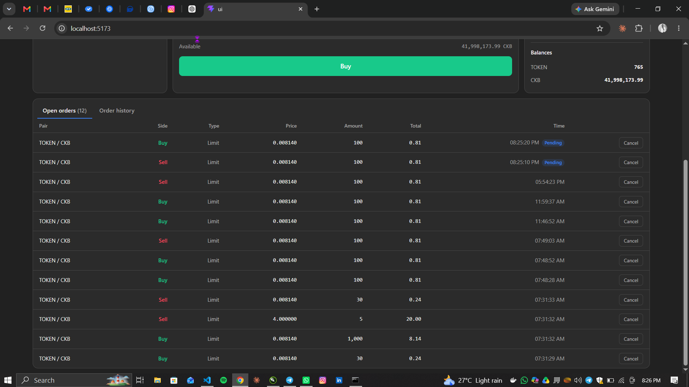

# CKB DEX Status Report — End-to-End Matching & Settlement

## Current Status

The bot was previously implemented but never wired into backend startup, so no orders were ever actually matched. That wiring is now in place, and this week's work went further: taking the bot from "starts up" to a fully verified, end-to-end trading loop. A user can now place a buy and a sell order through the UI, and the system will discover, match, settle, and confirm the trade automatically, with the order book, open orders, and trade history all updating live.

Several correctness and reliability bugs were found and fixed along the way, largely surfaced by that end-to-end testing rather than visible in isolated unit tests. Manual QA (real devnet, real wallet, real UI) was essential in finding them.

## Delivered / Integrated This Week

- **Live order matching and settlement, confirmed working end-to-end.** Verified by placing real matching orders through the UI and watching them move from discovered → matched → settlement submitted → confirmed filled, fully automatically.
- **Trade history is now recorded correctly.** The bot's own settlement and fill-confirmation logic previously wrote order status directly to the database, bypassing the same event pipeline used for order discovery — so a `Trade` record was never created for a confirmed match, and "Recent Trades" stayed empty no matter how many trades executed. Settlement submission and fill confirmation now go through that same validated pipeline, so trades are recorded and broadcast correctly.
- **Settlement fee handling corrected.** The dex-order-lock contract requires the seller be paid in full (capacity + price, no deduction) — the network fee can only come from unclaimed surplus capacity on the buy order. Both the backend's settlement logic and the UI's buy-order construction now agree on this and reserve the right amount of headroom.
- **"My Orders" no longer disappears on refresh.** A field-name mismatch (`makerLockHash` vs. the actual `ownerLockHash` stored on each order) meant the API and the maker-specific WebSocket channel always returned an empty list for a user's own orders — even though the orders were being indexed and stored correctly. This is fixed.
- **The bot now fails fast instead of drifting to a public network.** Its CKB client was missing a safety setting (`fallbacks: []`) already present on the UI's client, so any hiccup talking to the local devnet node caused it to silently retry against public testnet endpoints instead of the intended local chain.
- **Confirmation latency fixed.** A submitted settlement was previously only checked for on-chain confirmation once a 5-minute reservation window had fully expired — conflating "time to check" with "time to give up." Trades that confirmed in seconds could sit showing "Pending" for up to 5 minutes. Confirmation is now checked on every poll cycle; the 5-minute window is only used to give up on a stuck reservation.

## Ready to Use

- Placing limit buy/sell orders through the UI (wallet-connected or devnet dev-key signer).
- Automatic matching and settlement of exact-match orders (same token, amount, and price) — partial fills and price-time matching across differing amounts remain out of scope for this PoC, as previously noted.
- Live order book, open orders, order history, and recent trades, all updating in real time without a page refresh.
- Cancelling an open order from the UI.

## Testing & Tooling Improvements

A few changes specifically targeted at making local end-to-end testing faster and less error-prone:

- **Realtime updates now actually update live.** Previously, an empty update (e.g. the order book clearing out right after the only two resting orders filled) was silently dropped by the UI, so testers had to refresh to see the true state — and refreshing masked the real bug further by falling back to unrelated demo data when the book was empty. Testers can now trust what's on screen without refreshing.
- **Devnet RPC port aligned with the repo's existing `.env` expectations**, so the local devnet, backend, and UI agree on `127.0.0.1:28114` without per-environment overrides.
- **Operational note for future manual test runs:** the matcher only ever attempts the single best-priced eligible pair per poll cycle, so one leftover bad order (e.g. underfunded, or referencing a stale deployment) can silently block all matching indefinitely. Test data should be cleared between manual test sessions to avoid this.

## Verification

- TypeScript compilation: passed with no errors (backend and UI).
- Full backend test suite: 18/18 passed, plus the MongoDB-backed market API integration test.
- Manual end-to-end verification: two separate matching order pairs placed through the UI were discovered, matched, settled, and confirmed by the bot, with correct live updates observed in the order book, open orders, and trade history throughout.

## Known Follow-ups

- Order cancellation detected on-chain (as opposed to a cancellation initiated through the bot's own settlement flow) still updates the database directly rather than through the event-ingestion pipeline, so it won't yet trigger a live UI update. Same category of fix as this week's settlement/fill work — good candidate for next week.
- Partial fills, market orders, and multi-order atomic matching remain outside the current PoC contract scope.
